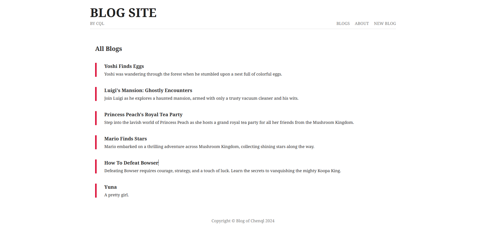

<!--
 * @Author: 陈巧龙
 * @Date: 2024-02-27 21:21:09
 * @LastEditors: Please set LastEditors
 * @LastEditTime: 2024-04-27 14:31:52
 * @FilePath: \Node.js\Node_Study\README.md
 * @Description: 说明文档
-->
# Blog Site

## 项目简介

1、本项目目前采用MVC的设计模式，搭建一个简易的博客网站，主要目的是学习对Node.js的使用。

2、技术层采用NodeJS + Express + EJS进行编写，数据库采用MongoDB。

3、部分代码未进行展示，目前项目正在持续更新中，欢迎大家一起沟通交流。

## 项目启动

### 依赖安装

> npm install

### 启动项目

> npm run serve

## 参考资料

##### 1、[Node.js](https://www.runoob.com/nodejs/nodejs-tutorial.html)

##### 2、[Express](https://nodejs.cn/express/starter/)

##### 3、[EJS](https://ejs.bootcss.com/)

##### 4、[MongoDB download](https://www.mongodb.com/try/download/community)

## 界面展示

